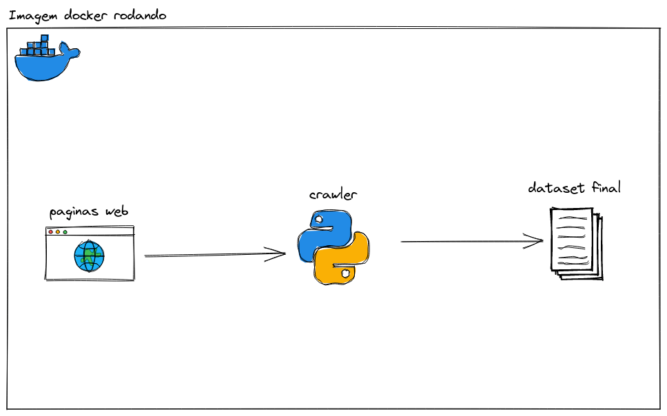

## Sobre o Projeto 
Minha solução para o teste técnico para vaga de Engenheiro de Dados Jr na InfoPrice

### Construido Com
* [Python](https://www.python.org/)
* [Pandas](https://pandas.pydata.org/)
* [Requests](https://pypi.org/project/requests/)
* [Backoff](https://pypi.org/project/backoff/)
* [BeautifulSoup4](https://pypi.org/project/beautifulsoup4/)
* [Lxml](https://pypi.org/project/lxml/)
* [Aiohttp](https://pypi.org/project/aiohttp/)
* [Docker](https://www.docker.com/)

### Estrutura de Diretórios
```sh
|--data #Pasta com o dados
	|--output #dados resultantes do crawler
|--webscraper #codigos do crawler
	|--ingestors #pasta com pacote de ingestor de dados
             |--data_ingestor.py #script com a classe DataIngestor, que utiliza o crawler
	|--scraper #pasta com pacote do crawler
             |--scraper.py #script com a classe Scraper, que realiza o scraping dos dados
	|--main.py #script principal
```

### Arquitetura do Projeto


## Implementação

Decidi fazer meu próprio crawler do zero, ao invés de usar o Scrapy. Por quê? Sincermente, eu achava que seria mais rápido eu fazer como eu já sabia do que aprender uma biblioteca nova e ainda desenvolver o crawler.
Eu estava errado? Com certeza! Porém aprendi muitas coisas no meio do processo. Em primeiro plano, decidi fuçar bastante o site da Comper, para ver como era a organização do site e seu funcionamento. 
Assim que achei as tags e classes que representavam o que eu precisava, e tendo mapeado quais urls eu deveria acessar, segui para o código do crawler. No desenvolvimento do código, foquei em primeiro
em ter certeza que eu conseguia retornar as informações necessárias para a entrega, então segui para refatorar o código em classes e metódos, seguindo umas regras de clean code e SOLID. Porém percebi que o crawler estava
muito lento, coisa de pegar 1.5 paginas por segundo, ou seja, escalaria muito mal. Então decidi utilizar programação assíncrona para fazer as requisições, sendo sincero foi aqui que gastei a maior parte do meu tempo.
 Primeiramente, eu não sabia programação assíncrona, e quando fiz funcionar as chamadas, o servidor me dava algumas barradas, porém consegui contornar com algumas estratégias de backoff. No fim, consegui subir para algo entre 13 a 21 chamadas por segundo,
que me deixou satisfeito com o resultado.

## Utilização

### Requisitos
* Docker
```sh
sudo apt get docker
```
* Docker-compose
```sh
sudo apt get docker-compose
```
* python
```sh
sudo apt get python3
```

### Instalação
* Clone o repositório
```sh
git clone https://github.com/brianamaral/infoprice-engenheiro-de-dados-teste-tecnico-scraping.git
```

### Rodar

#### Rodando com docker
* Rode o seguinte comando a partir da pasta raiz do repositório
```sh
make run-docker
```
#### Rodando localmente
* Rode o seguinte comando a partir da pasta raiz do repositório para inicializar o ambiente
```sh
make build
```
* E então rode o seguinte comando para iniciar a pipeline
```sh
make run
```

